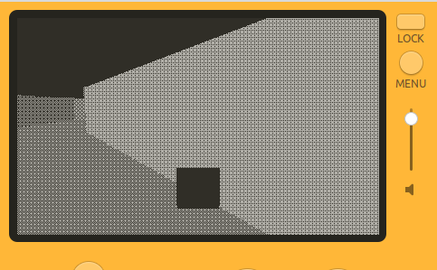

# Mini3D+

Enhanced 3D engine for the Panic Playdate. Based on the mini3d library provided in the examples.

If you are currently using or intend to use mini3d on the playdate, you can directly swap it out for mini3d-plus.



## New features

- Mesh clpping at camera (allows rendering faces which are partly behind the camera)
- Textures
  - To use greyscale textures, you must save the image with some extension other than `.png`, as the build script converts `.png` images into `.pdi`.
- Collision detection

## Build Instructions

You must have installed the [Playdate SDK](https://play.date/dev/). Be sure to set the `PLAYDATE_SDK_PATH` environment variable, as described in the SDK installation instructions.

This will build and launch the kart example:

```
make pdc
PlaydateSimulator ./3DLibrary.pdx
```

## Credits

If you use mini3d+, please credit the following.

- Dave Hayden (or Panic Software)
- [spng](https://libspng.org/)
- [miniz](https://github.com/richgel999/miniz)
- NaOH
- gingerbeardman (testing)