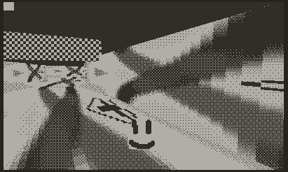

# Mini3D+

Enhanced 3D engine for the Panic Playdate. Based on the mini3d library provided in the examples.

If you are currently using or intend to use mini3d on the playdate, you can directly swap it out for mini3d-plus.


With textures:



## New features

- Mesh clpping at camera (allows rendering faces which are partly behind the camera)
- Textures
  - To use greyscale textures, you must save the image with some extension other than `.png`, as the build script converts `.png` images into `.pdi`.
- Collision detection

## Known bugs (and workarounds)

- Sometimes textures seem to 'jump' or 'flex.' There are two reasons for this:
  1. projective texture mapping is disabled for faces that are close to flush with the surface or are far from the camera. Try increasing `TEXTURE_PROJECTIVE_RATIO_THRESHOLD` or disabling the check altogether.
  2. Actually, the second cause is not fully understood, but it appears to happen only when clipping quads. Try using triangles instead of quads. 

## Build Instructions

You must have installed the [Playdate SDK](https://play.date/dev/). Be sure to set the `PLAYDATE_SDK_PATH` environment variable, as described in the SDK installation instructions.

This will build and launch the kart example:

```sh
make pdc
PlaydateSimulator ./3DLibrary.pdx
```

## Using as a Library in another Project

Instead of copying the Mini3D+ library wholesale and editing it for your own purposes, it is recommended to instead include the Mini3D+ library
externally (or as a git submodule). You will need to use a Makefile in order to acheive this. Instructions for C projects and Lua-only projects that don't already have a Makefile are provided:

### For C Projects

Replace the following line in your Makefile: `include $(SDK)/C_API/buildsupport/common.mk` with

```Makefile
CLANGFLAGS += -DMINI3D_AS_LIBRARY
UDEFS += -DMINI3D_AS_LIBRARY
include path/to/mini3d-plus/Makefile
```

(**Important**: you must edit this include path according to the location of mini3d-plus on your system!)

Then, in the C file with your [`eventHandler` function](https://sdk.play.date/1.9.3/Inside%20Playdate%20with%20C.html#_game_initialization), add this include:

```
#include <mini3d.h>
```

and add this line to your `eventHandler`:

```
mini3d_eventHandler(playdate, event, arg);
```

### For Lua-only projects (with no Makefile)

Create the following file in your project root, and call it `Makefile`:

```
PRODUCT = MyProject.pdx
include /path/to/mini3d-plus/Makefile
```
(**Important**: you must edit this include path according to the location of mini3d-plus on your system!)

From now on, instead of using `pdc` to compile your project, you must follow the instructions in the [Playdate C guide](https://sdk.play.date/1.9.3/Inside%20Playdate%20with%20C.html). You will likely need to do `make simulator pdc` (use `make device` to build for an actual Playdate instead of the simulator).

## Performance Tips

- Do not get your hopes up. Test on the device often. 20 fps is the dream, fam.
- Textures are slower than non-textured surfaces.
- If using textures, consider enabling texture scanlining so that on textured surfaces only odd (or only even) rows are drawn.
- Carefully look over the macros in mini3d.h. You may want to change some of these.
- In particular, if using textures, disable TEXTURE_PERSPECTIVE_MAPPING if possible (i.e. if textured objects are not very close to camera.)
- A significant performance boost can be gained with Keil [armclang](https://developer.arm.com/downloads/-/arm-compiler-for-embedded) (available for free with the [community license](https://www.keil.com/pr/article/1299.htm)), also [here](https://developer.arm.com/downloads/-/arm-development-studio-downloads) (30-day free trial license available). On the kart demo, gcc gives ~17.5 fps, armclang gives ~20fps)

## Credits

If you use mini3d+, please credit the following.

- Dave Hayden (or Panic Software)
- [spng](https://libspng.org/)
- [miniz](https://github.com/richgel999/miniz)
- NaOH
- gingerbeardman (testing)

## Credits (demo)

- [Keith at Fertile Soil Productions](https://opengameart.org/content/racing-kart) - for prov the kart model in the demo
- [chained_tan](https://twitter.com/chained_tan) - for providing the Touhou character in the kart demo